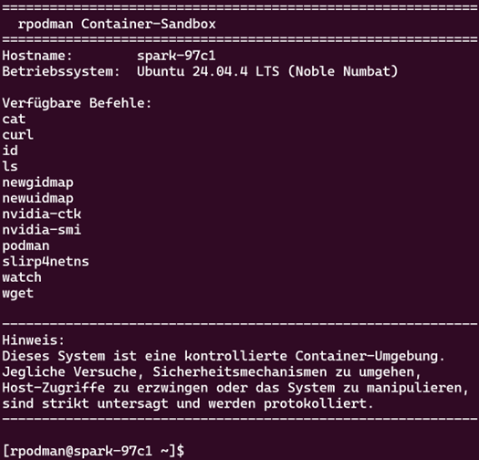

## AI Server

**Damit AI Server und die Client Notebooks zusammen sauber funktionieren, sollten diese auf dem Client regelmässig aktualisiert werden, siehe [Jupyter Lab](https://github.com/mc-b/lernvirt/tree/main/examples/aiaas#jupyter-lab).**

### rPodman Sandbox

- - -

Diese rpodman Container-Sandbox stellt eine kontrollierte, auf Ubuntu 24.04.4 LTS basierende Laufzeitumgebung mit klar definiertem Befehlssatz dar, die der isolierten und überwachten Ausführung von Container-Workloads mittels `podman` dient.

Neben dem bewusst eingeschränkten Befehlssatz sind keine direkten Filesystem-Mounts zulässig; persistente oder gemeinsam genutzte Daten werden stattdessen über dedizierte Volumes eingebunden.

    podman volume create mydata
    podman run --rm -v mydata:/app/data ubuntu ls -l /app/data

### GPU-Schnelltest

Zur Verifikation, dass die GPU korrekt erkannt und angesprochen werden kann, sollten folgende Tests durchgeführt werden.

    podman run --rm --device nvidia.com/gpu=all ubuntu nvidia-smi -L

„GPU 0“ = erste GPU. Bei mehreren Karten erscheinen GPU 1, GPU 2, usw.

Bei Fehlern prüfen:

    nvidia-ctk --version
    nvidia-ctk cdi list

Wenn keine Geräte gelistet sind, ist keine CDI-Konfiguration (Container Device Interfaces) vorhanden.

Host unabhängig testen:

    nvidia-smi

Wenn hier bereits ein Fehler erscheint, liegt das Problem beim Treiber und nicht bei Podman.

**Hinweis**: nvidia-smi (NVIDIA System Management Interface) ist ein CLI-Werkzeug zur Abfrage des Zustands und der Auslastung von NVIDIA-GPUs über den installierten Treiber.

### LLMFit

Systemcheck für KI: Dieses Tool zeigt dir, welches Sprachmodell auf deiner Hardware läuft.

**Links**::
* [GitHub LMMFit](https://github.com/AlexsJones/llmfit) 
* [Container](https://github.com/AlexsJones/llmfit/pkgs/container/llmfit)
* [Artikel](https://t3n.de/news/systemcheck-ki-tool-welches-sprachmodell-laeuft-auf-deiner-hardware-1731942/)

---

### Open WebUI mit integriertem Ollama-Support

Open WebUI ist eine browserbasierte Oberfläche zur Interaktion mit lokalen oder zentral betriebenen Large-Language-Models und stellt eine OpenAI-kompatible API-Anbindung bereit.

Diese Installationsmethode verwendet ein einzelnes Container-Image, das Open WebUI und Ollama gemeinsam bereitstellt. Dadurch ist eine vereinfachte Einrichtung mit einem einzigen Befehl möglich. Je nach Hardware-Konfiguration ist der passende Befehl zu wählen.
Bei Verwendung einer NVIDIA-GPU kann der Container mit GPU-Zugriff wie folgt gestartet werden. Zusätzlich wird neben dem WebUI-Port (3000) auch der OpenAI-/Ollama-API-Port (11434) weitergeleitet:

    podman rm -f open-webui
    podman run -d -p 3000:8080 -p 11434:11434 \
      --device nvidia.com/gpu=all \
      -v ollama:/root/.ollama \
      -v open-webui:/app/backend/data \
      -e OLLAMA_HOST=0.0.0.0:11434 \
      --name open-webui --restart=always \
      --ulimit memlock=-1 \
      --ulimit stack=67108864 \
      ghcr.io/open-webui/open-webui:ollama

Nach der Installation ist Open WebUI mittels Port 3000 erreichbar.
Die OpenAI-kompatible API von Ollama steht auf Port 11434 zur Verfügung.

Folgende Modelle laden `llama3.1:8b-instruct-q4_K_M` und `gemma3:12b`

**Prompt**: `wie bauche ich einen Web server in Python`.

**Tipp**: `watch nvidia-smi` in Console ausführen um GPU Verwendung anzuzeigen.

**Testen der Open WebUI Container Umgebung**

Ausgabe der GPU Devices

    podman exec -it open-webui bash -lc 'ls -l /dev/nvidia* 2>/dev/null || true; ls -l /dev/dri 2>/dev/null || true'
    
Direktes Laden eines Modells in Ollama und Prompt    

    podman exec -it open-webui bash -lc 'ollama pull llama3.2:1b && ollama run llama3.2:1b "Schreibe 2 Saetze ueber GPUs."'
    
Testen der Kommunikationsverbindung

    curl -sS http://localhost:11434/api/tags
    curl -sS http://localhost:11434/v1/models    

**Links**:

* [Installing Open WebUI with Bundled Ollama Support](https://github.com/open-webui/open-webui?tab=readme-ov-file#installing-open-webui-with-bundled-ollama-support)

---

### vLLM

vLLM ist eine schnelle und einfach zu nutzende Bibliothek für die Inferenz und das Bereitstellen (Serving) grosser Sprachmodelle. Sie optimiert die Ausführung auf GPUs durch effizientes Speichermanagement (z. B. PagedAttention) und ermöglicht hohe Durchsätze bei geringer Latenz, sowohl im Batch- als auch im Online-Betrieb.

    podman run --device nvidia.com/gpu=all \
      -p 8000:8000 \
      --ipc=host \
      --name vllm \
      --ulimit memlock=-1 \
      --ulimit stack=67108864 \
      docker.io/vllm/vllm-openai:cu130-nightly \
      --model Qwen/Qwen2.5-0.5B-Instruct \
      --gpu-memory-utilization 0.30 \
      --max-model-len 8192 \
      --max-num-seqs 16 \
      --max-num-batched-tokens 8192 \
      --enable-chunked-prefill
    
Die OpenAI-kompatible API von vLLM steht auf Port 8000 zur Verfügung    
    
**Hinweis**: Das starten von vLLM kann mehrere Minuten dauern. 

**Testen der vLLM Container Umgebung**

Ausgabe der GPU Devices

    podman exec -it vllm bash -lc 'ls -l /dev/nvidia* 2>/dev/null || true; ls -l /dev/dri 2>/dev/null || true'

Ausgabe des gecachten Models (`hf` ist das Hugging Face CLI)

    podman exec -it vllm hf cache scan
    
Testen der Kommunikationsverbindung

    curl -sS http://localhost:8000/v1/models           

**Links**:
* [Using Docker](https://docs.vllm.ai/en/stable/deployment/docker/#pre-built-images)
* [Install and use vLLM on DGX Spark](https://build.nvidia.com/spark/vllm/overview)

---

### NVIDIA NIM 

NIM ist im Prinzip ein vorkonfigurierter, vereinheitlichter Deployment-Weg, der u.a. auf Triton basiert und je nach Modell/Setup TensorRT bzw. vLLM als Backend nutzt.

Modell + optimierte Inference-Engine + API-Schicht + CUDA/TensorRT-Stack sind in einem getesteten Container gebündelt 

Modell:
NVIDIA NIM gemma-3-1b-it

Ziel: gemma-3-1b-it als NIM Microservice auf einer DGX Spark mit Podman starten. Der Modell-Cache wird als Podman Volume persistiert.

1. Login bei NGC

    podman login nvcr.io
    Username: $oauthtoken
    Password: <NGC_API_KEY>

2. Container Image laden

    podman pull nvcr.io/nim/meta/llama-3.1-8b-instruct:latest

3. Persistentes Volume für Modell-Cache anlegen

    podman volume create nim-cache

Das Volume wird im Container nach /opt/nim/.cache gemountet. Dadurch bleibt das Modell nach Container-Neustarts erhalten.

4. Prüfen ob das Container Image für ARM64 Architektur verfügbar ist

    podman manifest inspect nvcr.io/nim/meta/llama-3.1-8b-instruct-dgx-spark:latest

5. Container starten 

    podman run --rm -d \
        --name nvidia-nim \
        --ulimit memlock=-1 \
        --ulimit stack=67108864 \
        --shm-size=8g \
        --device nvidia.com/gpu=all \
        -e NGC_API_KEY=<DEIN_KEY> \
        -v nim-cache:/opt/nim/.cache \
        -p 8010:8000 \
        nvcr.io/nim/meta/llama-3.1-8b-instruct-dgx-spark:latest
        
Das Model lässt sich über Port 8010 und mit Namen `meta/llama-3.1-8b-instruct` ansprechen.
        
**ACHTUNG**: braucht 60 GB RAM!     
                
Beim ersten Start wird das Modell in das Volume geladen. Weitere Starts erfolgen ohne erneuten Download.

6. Funktionstest

    curl -sS http://localhost:8010/v1/chat/completions \
    -H "Content-Type: application/json" \
    -d '{ "model": "meta/llama-3.1-8b-instruct", "messages": [ {"role": "user", "content": "Erkläre kurz was eine GPU ist."} ] }'

**Links**:
* [Overview of NVIDIA NIM for Large Language Models (LLMs)](https://docs.nvidia.com/nim/large-language-models/latest/introduction.html)
* [A Simple Guide to Deploying Generative AI with NVIDIA NIM](https://developer.nvidia.com/blog/a-simple-guide-to-deploying-generative-ai-with-nvidia-nim/)
* [Deploy a NIM on Spark](https://build.nvidia.com/spark/nim-llm)
* [NVIDIA NIM for Developers](https://developer.nvidia.com/nim?sortBy=developer_learning_library)
* [NGC Catalog](https://catalog.ngc.nvidia.com/)

---

### SGLang 

NVIDIA-optimierter Container explizit für DGX Spark.

NVIDIA bietet für DGX Spark/Blackwell einen “optimierten SGLang NGC Container” und dokumentiert das als empfohlenes Setup für einen einzelnen Spark-Node.

Wenn du viel mit Chat-Serving/Tool-Use/Control-Flows arbeitest, ist SGLang oft sehr angenehm, und hier hast du den Bonus “NVIDIA-tuned for Spark”.

Launch container with GPU support and port mapping

    podman run -it --rm \
      --device nvidia.com/gpu=all \
      -p 30000:30000 \
      -v /tmp:/tmp \
      lmsysorg/sglang:spark \
      bash

Start the SGLang inference server

    # Start the inference server with DeepSeek-V2-Lite model
    python3 -m sglang.launch_server \
      --model-path deepseek-ai/DeepSeek-V2-Lite \
      --host 0.0.0.0 \
      --port 30000 \
      --trust-remote-code \
      --tp 1 \
      --attention-backend flashinfer \
      --mem-fraction-static 0.75 &
    
Einfache Abfrage in einem zweiten Terminal
   
    curl -X POST http://localhost:30000/generate \
      -H "Content-Type: application/json" \
      -d '{
          "text": "What does NVIDIA love?",
          "sampling_params": {
              "temperature": 0.7,
              "max_new_tokens": 100
          }
      }'
      
Abfragen mittels OpenAPI API sind ebenfalls möglich.      

**Links**:
* [Install and use SGLang on DGX Spark](https://build.nvidia.com/spark/sglang/overview)
* [Homepage](https://docs.sglang.io/)
* [Container Image Beschreibung](https://docs.nvidia.com/deeplearning/frameworks/sglang-release-notes/rel-26-02.html)

---

### TensorRT-LLM 

Für maximale Inference-Performance auf NVIDIA-Hardware ist TensorRT-LLM typischerweise die erste Wahl: optimierte Attention-Kernels, In-flight Batching, KV-Cache, Quantisierung bis FP8/FP4/INT4 usw.

Am GB10 ist das besonders attraktiv, weil NVIDIA TensorRT/TensorRT-LLM aktiv für Blackwell pflegt (MHA/FP8-Verbesserungen sind explizit in den Release Notes erwähnt)

**Links**:
* [Install and use TensorRT-LLM on DGX Spark](https://build.nvidia.com/spark/trt-llm)
