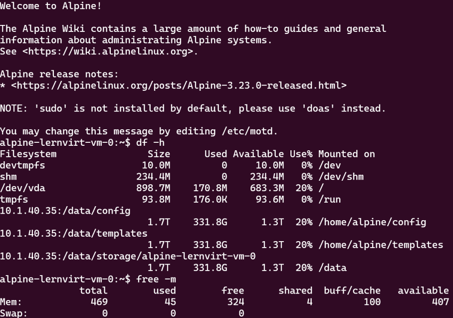

alpine
----

---

**Alpine Linux** ist eine schlanke, sichere und ressourcensparende Linux-Distribution, die besonders für Server, Container und virtuelle Umgebungen geeignet ist. 

In dieser Umgebung steht eine **kleine Alpine-Installation** zur Verfügung, in der bereits grundlegende Dienste wie **NFS** für Dateifreigaben und **WireGuard** 
für sichere Netzwerkverbindungen eingerichtet sind.

Zusätzlich:
* vm-0: Alpine ohne Zusatzsoftware
* vm-1: Docker und Juypter-Lab auf Port 33188 (ohne RAG, wegen Abhängigkeit zu `onnxruntime`)
* vm-2: k3s Kubernetes (FIXME `doas chmod +r /etc/rancher/k3s/k3s.yaml` falls `kubectl` reklamiert)

Weitere Software wird unter Alpine einfach über den Paketmanager **`apk`** installiert, z. B. mit `apk add <paketname>`. 

Host spezifische Werte festlegen

    HELM_VALUES_HOST=hosts/<host>.yaml
    
Installation

    helm install alpine . -n alpine --create-namespace -f examples/alpine/values.yaml -f ${HELM_VALUES_HOST}
    
Kontrolle

    kubectl get sc,pv,pvc,dv,vm,vmi -n alpine
    
Löschen

    helm uninstall alpine -n alpine && kubectl delete ns alpine    
    
Testen

    virtctl console vm-0 -n alpine 
    
**Achtung:** Der User ist `alpine` nicht `ubuntu`.