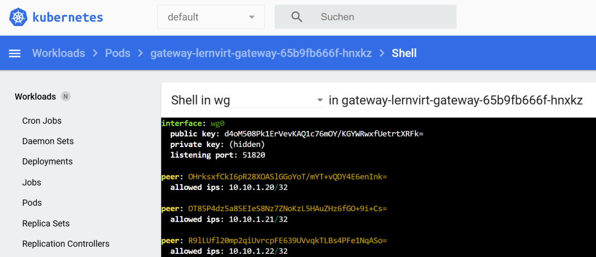

## lernvirt nur als WireGuard-Gateway verwenden

---

### Voraussetzungen

* Laufender Kubernetes-Cluster
* `helm` und `kubectl` konfiguriert
* WireGuard auf den Clients bzw. dem Kubernetes-Host installiert (`wg`, `wg-quick`)

### Installation nur als Gateway

   Im gewünschten Namespace (oder `default`) das Chart mit der Gateway-Values-Datei installieren:

    helm install gw . -f examples/gateway/values.yaml

Mit dieser Konfiguration werden keine VMs erzeugt, sondern nur der WireGuard-Gateway (Deployment + Service + Secrets).

### Weitere Clients verwalten (script/wg-clients.sh)

Mit dem Script `wg-clients.sh` kannst du zusaeztliche WireGuard-Clients anlegen oder in einem Bereich loeschen, z.B. um eine neue Klasse hinzuzufügen oder wieder zu entfernen.

Typische Verwendung:

    # Clients hinzufuegen
    wg-clients.sh add --fullname gw-lernvirt --endpoint <FQDN-ODER-IP> --count 24 --output-dir ./out [--namespace <NS>] 
    
    # Clients in einem Bereich loeschen
    wg-clients.sh delete --fullname gw-lernvirt [--namespace <NS>] <FROM_ID> <TO_ID>

Kurzbeschreibung der wichtigsten Parameter:

* `--fullname NAME`
  Prefix der Kubernetes-Objekte (wie oben beschrieben, z.B. `gw-lernvirt`).

* `--endpoint HOSTNAME_OR_IP`
  Oeffentlicher WireGuard-Endpoint, den die Clients erreichen (z.B. `vpn.example.com` oder die IP eines Nodes / LoadBalancers).

* `--namespace NS`
  Kubernetes-Namespace (Standard: `default`, falls im Script so gesetzt).

* `--count N`
  Anzahl neuer Clients, die erzeugt werden sollen.

* `--start-id ID`
  Optionale erste Host-ID. Wenn nicht gesetzt, sucht das Script automatisch die naechste freie ID.

* `--output-dir DIR`
  Verzeichnis, in das die Klartext-`wg0.conf`-Dateien der neuen Clients geschrieben werden (z.B. `./wg-clients`).

* `delete FROM_ID TO_ID`
  Loescht alle Secrets `<FULLNAME>-client-<ID>` fuer IDs im Bereich `FROM_ID` bis `TO_ID` inklusive.

## Kubernetes-Host selbst ins WireGuard-Netz aufnehmen

Wenn auch der Rechner, auf dem Kubernetes laeuft, als Client im WireGuard-Netz sein soll, kannst du einfach die erste erzeugte Client-Konfiguration verwenden (z.B. Host-ID 2 oder 100, je nach Setup).

Vorgehen:

1. Mit `wg-clients.sh add ...` mindestens einen Client erzeugen und `--output-dir` verwenden.

2. Die erzeugte Datei, z.B. `./wg-clients/client-2-wg0.conf`, auf den Kubernetes-Host kopieren (oder direkt dort erzeugen).

3. Auf dem Kubernetes-Host als `wg0.conf` ablegen, typischerweise:

    sudo mkdir -p /etc/wireguard
    sudo cp client-2-wg0.conf /etc/wireguard/wg0.conf
    sudo chmod 600 /etc/wireguard/wg0.conf

4. Interface starten:

    sudo wg-quick up wg0

   Optional beim Booten automatisch starten:

    sudo systemctl enable wg-quick@wg0

Damit ist lernvirt in diesem Setup nur als zentrales WireGuard-Gateway im Einsatz, ohne dass VMs im Cluster betrieben werden. 

Weitere Clients (z.B. Klassen, Admin-Laptops, Schulungsrechner) werden ausschliesslich ueber `wg-clients.sh` verwaltet.
